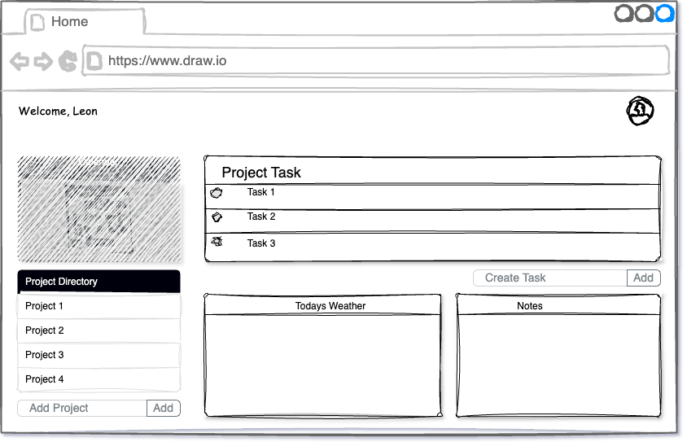
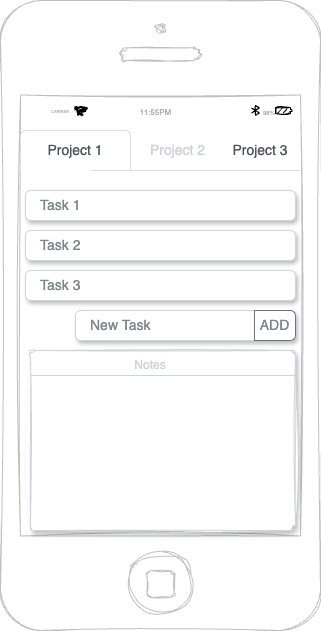
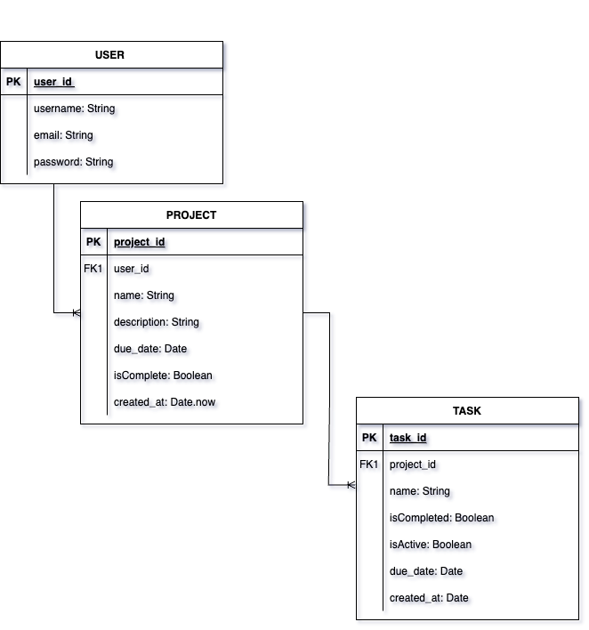

# My-To-Do Web App
This is a simple TO-DO list web application that allows users to manage their tasks efficiently. Users can add, delete, and mark tasks as completed.

## WireFrame
#### Desktop/Large

#### Tablet/Medium

#### Mobile/Small

## ERD

## Features
- Add new task
- Delete task
- Edit task
- Mark task Status(Complete, Working, Not Started)
- Store task list 

## Technologies Used
- **Frontend**: HTML, CSS, JavaScript
- **Backend**: Node.js, Express, Cors, Axios, Mongoose
- **Database**: MongoDB

## User Stories
- User can use an input field to type in a to-do item.
- By pressing enter or a button the user can submit the to-do item.
- User can mark an item status (Complete, Working on, Not Started).
- User can Add, Remove, and Edit item(s) from the list.
- After the browser is closed the user(s) data will be saved to storage.
